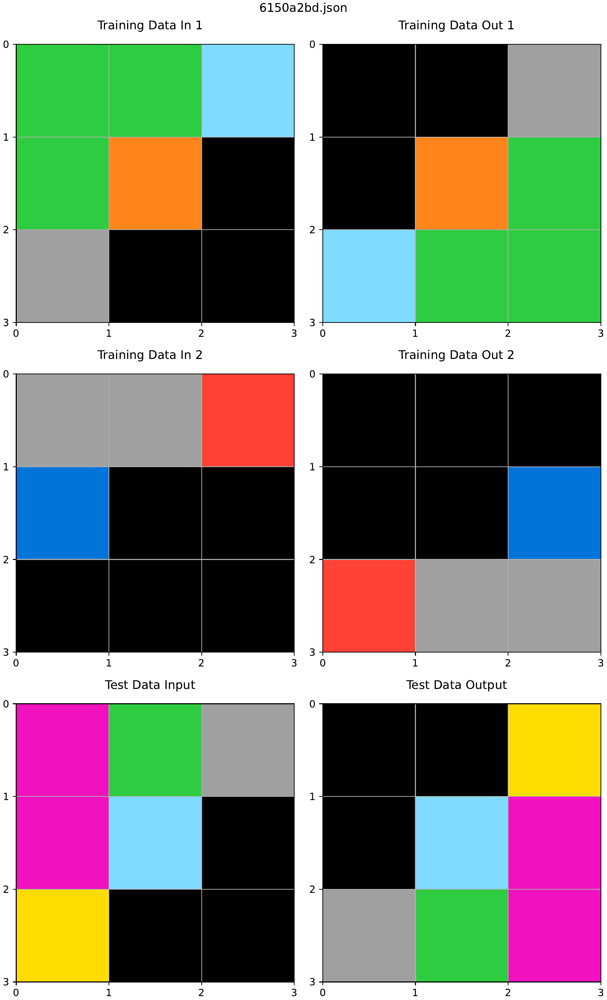
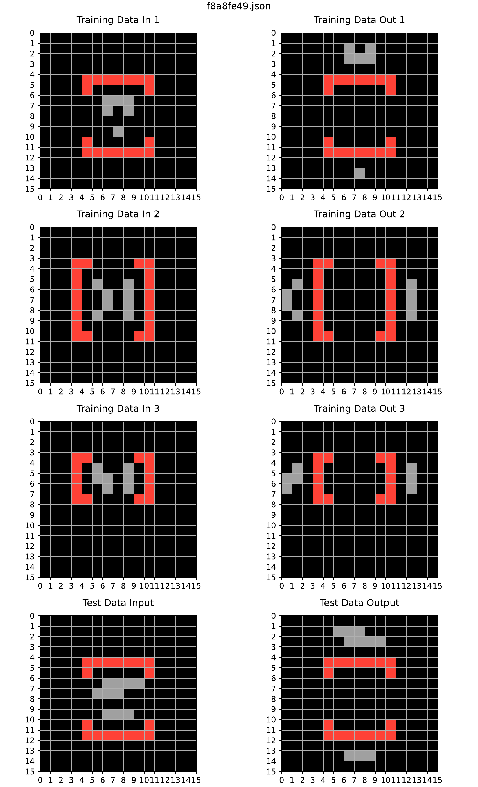
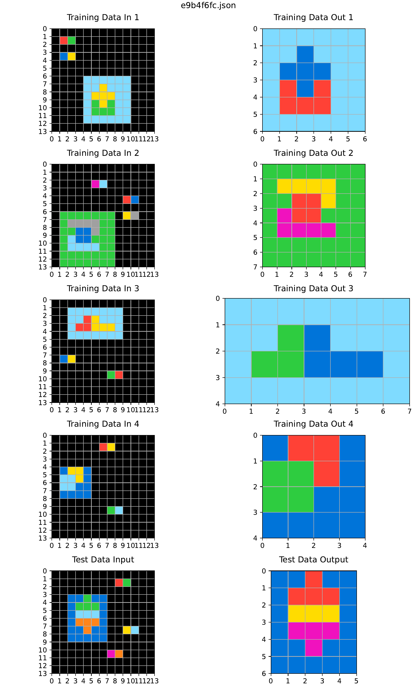

# ARC-AGI Abstract Reasoning Agent

An autonomous reasoning agent for solving ARC-AGI visual reasoning tasks by inferring transformations from input-output examples. The system analyzes grid structure and objects, generates candidate transformations, searches over possible transformation programs, verifies candidates against training examples, and applies successful programs to unseen test inputs.

**Author:** Abukar Aweis

> This project was completed as part of Georgia Tech's CS 7637: Knowledge-Based AI course. Course-provided framework and evaluation files are not included in this repository. I wrote all code in `ArcAgent.py` and `Utilities.py`, and I wrote the accompanying project report.

## Results

The final agent solved **89 of 96 problems (92.7%)** across three increasingly difficult evaluation sets.

- **Hidden test problems solved:** 41/48
- **Set B:** 31/32
- **Set C:** 31/32
- **Set D:** 27/32

## How It Works

The agent follows a programmatic reasoning pipeline:

1. Analyze the training input and output grids.
2. Detect objects and extract properties such as size, position, color, bounding boxes, and spatial relationships.
3. Generate candidate transformations from a library of grid- and object-level operations.
4. Search over candidate transformation sequences using breadth-first search.
5. Verify candidate programs against all provided training examples.
6. Apply successful programs to unseen test grids.

## Transformation Library

The agent uses a large library of reusable transformations for ARC-style reasoning, including:

- cropping and object extraction
- rotations and reflections
- color replacement and recoloring
- connected-component analysis
- object alignment and movement
- duplication and tiling
- gap and pattern filling
- path and line drawing
- logical grid operations
- object relationship reasoning
- majority- and region-based transformations

## Implementation

### `ArcAgent.py`

Contains the main solving pipeline, including:

- training-example analysis
- candidate transformation generation
- breadth-first search over transformation programs
- validation against training examples
- generation of predictions for unseen test grids

### `Utilities.py`

Contains the supporting reasoning and transformation logic, including:

- connected-component object detection
- grid and object feature extraction
- geometric and spatial analysis
- transformation implementations
- helper functions used during search and validation

## Examples

Below is an example ARC-AGI task successfully solved by the agent.

  

In the figure, **Train Data In** and **Train Data Out** show the example input-output pairs used to infer the underlying transformation. **Test Data In** is the unseen input, and **Test Data Out** is the output produced by the agent.

### More Complex Solved Example

Task `f8a8fe49` required more complex object and spatial reasoning than the previous example. The agent identified the relevant object relationships and applied the learned transformation successfully to the unseen test input.

  

### Hidden-Test Generalization Failure

Task `e9b4f6fc` is an example where the agent correctly matched all provided training examples but failed on the hidden test case.

Because the hidden test input and expected output were not revealed to me, the exact failure cannot be visualized. The training examples are shown below to illustrate the type of pattern from which the agent attempted to generalize.

  

This illustrates an important limitation of the approach: a transformation can match every visible training example while still failing to capture the more general rule required for an unseen test case.

## Limitations

The agent performs best on tasks that can be represented using transformations contained in its existing reasoning library. More difficult ARC-AGI problems may require multi-stage abstractions, richer object relationships, or transformations that are not represented in the current search space.

## Technologies

- Python
- NumPy
- Breadth-first search
- Connected-component labeling
- Programmatic visual reasoning
- Object-based grid analysis

## Report

A detailed discussion of the agent design, experiments, successes, failures, and development process is available in the [project report](ARC-AGI-Report.pdf).